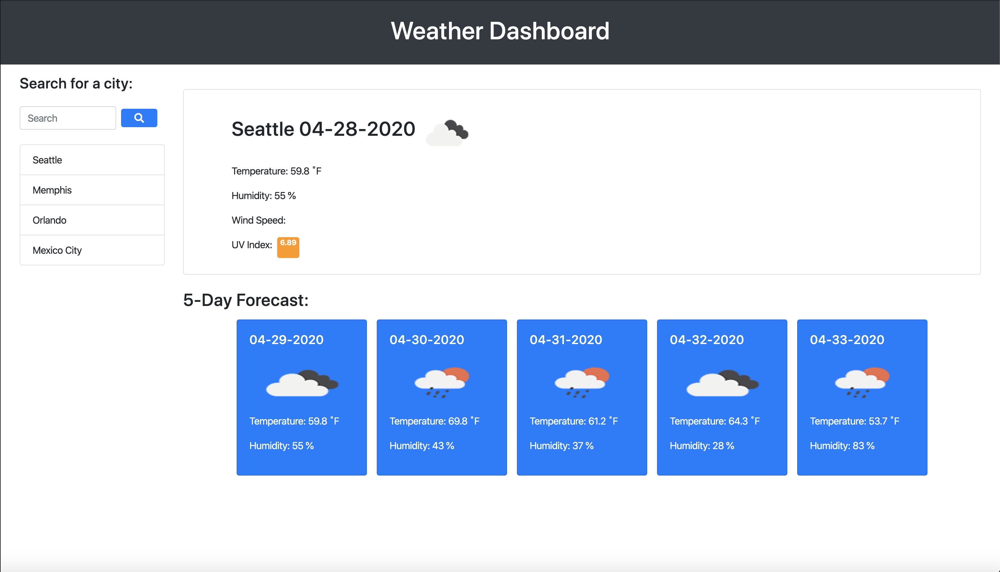

# H06-Weather-Dashboard

## Introduction 

 Weather Dashboard is an app that provides a forecast info for a specific location based on city name, Search history is stored in the local browser memory allocation and displayed on the left side as a list. Real time data is acquired from a server side API the infromation obtained is provided to the user in a friendly interface through a web browser, the information that is displayed is:
 
# 1 day detailed weather forecast containing:

- Average Day Temperature
- Humidity
- UV Index (Highlighted in its corresponsive color)
- Wind Speed
- Sky-view icon

# 5 day weather forecast containing:

- Forecast date
- Sky-view icon
- Average Day Temperature
- Humidity

## Getting started

To use the Weather Dashboard:

1. Type desired city to search on the top left side search bar. 
2. Press Enter keyboard Key or click the search button on the right side of the search bar.

## Demo the Application

A demo version of the application has been deployed to [Github](https://cristianmontenegrop.github.io/H06-Weather-Dashboard/)

## More Info

The Github for this project can be found here [Github repo](https://github.com/cristianmontenegrop/H06-Weather-Dashboard)

This project was created by **Cristian Montenegro**

